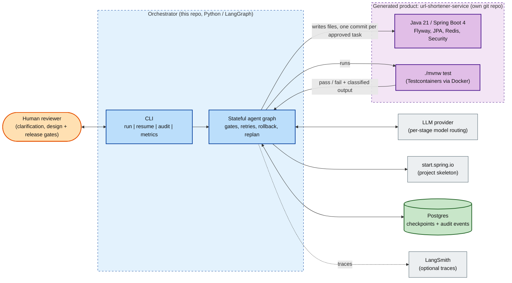
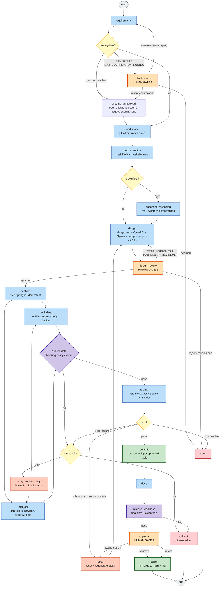
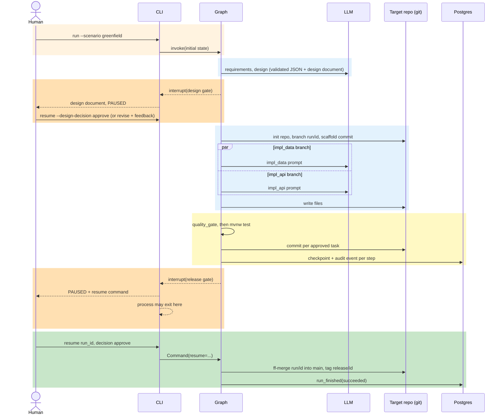
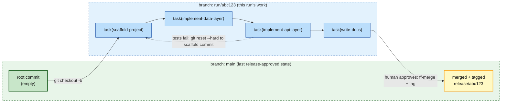
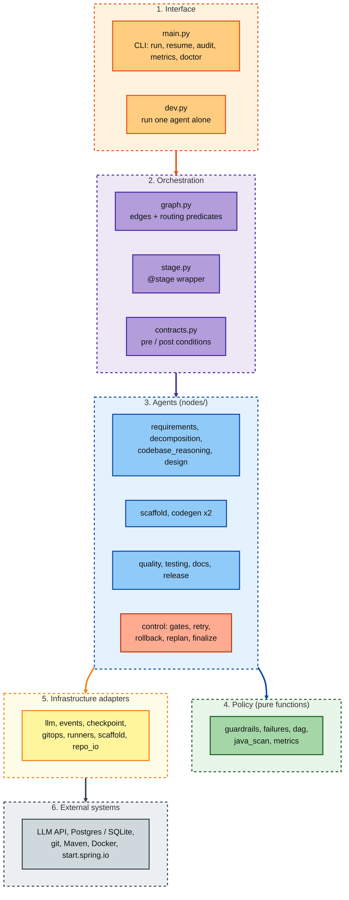

# Agentic SDLC System — URL Shortener

An **agentic software-engineering system**: a LangGraph orchestrator that turns a
requirement into a working, tested, documented **Java 21 / Spring Boot 4** URL
shortener — and later *extends* it — with gates, human approvals, bounded retries,
a fallback strategy, git-backed rollback, re-planning and an audit-grade event log.

```
agentic-sdlc-system/
├── orchestrator/            # the product of this repo: the multi-agent orchestrator (Python)
├── docker-compose.yml       # orchestrator infra only (Postgres for checkpoints + audit events)
└── ../url-shortener-service # DOES NOT EXIST until you run the greenfield scenario.
                             # The orchestrator creates it (its own git repo) at TARGET_REPO_PATH.
                             # The generated output of a reference run: https://github.com/ajayrahul11/url-shortener-service
```

**Nothing about the shortener is pre-written.** Greenfield refuses to run if the target
already exists; brownfield refuses to run if it does *not*. That ordering is enforced by
the workspace node's preconditions, not by convention.

## Quick start

### Prerequisites

| Tool | Version | Why | Check |
|---|---|---|---|
| Python | 3.11+ | the orchestrator | `python3 --version` |
| git | any recent | per-run branches, one commit per task, rollback | `git --version` |
| Docker Desktop (or Engine + Compose v2) | running | orchestrator Postgres, Testcontainers in the generated tests, and the deploy verification | `docker info` |
| JDK | **21** (17 works if you set `JAVA_VERSION=17`) | builds the generated Spring Boot 4 project | `java -version` |
| Anthropic API key | | the LLM (only needed for real runs, not `--offline`) | |
| Free host ports | **5433** (orchestrator DB), **8080** (generated service during deploy verification) | | `lsof -i :8080` |

> The Maven wrapper prefers `JAVA_HOME` over `PATH`. If `JAVA_HOME` points at an older JDK than `JAVA_VERSION`
> but a newer one is on `PATH`, the orchestrator ignores `JAVA_HOME` for Maven and `doctor` tells you.
> On macOS: `brew install --cask temurin@21`, or `brew install openjdk@21` and
> `export JAVA_HOME=$(/usr/libexec/java_home -v 21)`.

### Step 1: install

```bash
git clone https://github.com/ajayrahul11/agentic-sdlc-system.git
cd agentic-sdlc-system/orchestrator
python3 -m venv .venv && source .venv/bin/activate
pip install -e ".[dev]"
```

### Step 2: prove the wiring offline (no key, no Docker, no network, no cost)

```bash
pytest                                                    # full offline suite, ~15 s
python -m sdlc_orchestrator run --offline --scenario greenfield \
    --requirement "Build a URL shortener with shorten, redirect, and click analytics" --non-interactive
# paused at the DESIGN gate (no code exists yet). Approve, then it pauses at the RELEASE gate:
python -m sdlc_orchestrator resume <run_id> --offline --design-decision approve --approver you
python -m sdlc_orchestrator resume <run_id> --offline --decision approve --approver you --rationale "smoke"
python -m sdlc_orchestrator reset-target --offline        # type "yes"; clears the offline target
```

### Step 3: configure a real run

```bash
cp .env.example .env
```

Edit `orchestrator/.env`. Only these need your attention; every other default is tuned and safe:

| Variable | Set it to | Notes |
|---|---|---|
| `ANTHROPIC_API_KEY` | your key | required for real runs |
| `JAVA_VERSION` | `21` (default) or `17` | must be <= the JDK `java -version` reports |
| `MAX_RUN_COST_USD` | e.g. `2.0` | **hard spend cap per run** (default 3.5). A normal greenfield run costs roughly $0.5 to $1.5 |
| `LANGCHAIN_API_KEY` + `LANGCHAIN_TRACING_V2=true` | optional | LangSmith traces; the audit log never depends on it |
| `CHECKPOINTER` / `EVENT_SINK` | `sqlite` / `jsonl` | optional: skip Postgres entirely (state under `orchestrator/runs/`) |

Leave `ORCHESTRATOR_DB_URL` as is when using the bundled Postgres.

```bash
docker compose -f ../docker-compose.yml up -d            # orchestrator Postgres on :5433
python -m sdlc_orchestrator doctor                       # every row must say yes
```

`doctor` checks the API key, Postgres, the JDK Maven will really use, Docker, start.spring.io reachability and the target repo state.

### Step 4: run the three scenarios (order matters: brownfield needs the greenfield output)

```bash
# 1. GREENFIELD: creates ../url-shortener-service (its own git repo) from nothing
python -m sdlc_orchestrator run --scenario greenfield \
    --requirement "Build a URL shortener with shorten, redirect, and click analytics" --non-interactive
#    -> pauses at the DESIGN gate. Read orchestrator/runs/<run_id>/DESIGN.html (colourful design doc with sequence diagrams,
#       risks and trade-offs). Then:
python -m sdlc_orchestrator resume <run_id> --design-decision approve --approver you
#    (or: --design-decision revise --feedback "add Redis-down failover detail"  /  --design-decision reject)
#    -> scaffold, parallel codegen, quality gate, mvnw test, DEPLOY VERIFICATION (builds the image, starts the compose stack,
#       calls the live APIs), docs, then pauses at the RELEASE gate:
python -m sdlc_orchestrator resume <run_id> --decision approve --approver you --rationale "tests + deploy verification green"
#    -> fast-forward merge into main of the generated repo + tag release/<run_id>

# 2. BROWNFIELD: extends the generated service (refuses to run if it does not exist)
python -m sdlc_orchestrator run --scenario brownfield \
    --requirement "Add custom alias support and geo-breakdown analytics" --non-interactive
#    -> codebase reasoning over the real repo, design gate, impacted-files-only codegen, migrations immutable, same gates

# 3. AMBIGUOUS: the vague request is stopped BEFORE anything is built
python -m sdlc_orchestrator run --scenario ambiguous --requirement "Make the system more reliable" --non-interactive
python -m sdlc_orchestrator resume <run_id> --resolution "99.9% availability; redirect p99 < 50 ms" --approver you
#    (or `resume <run_id> --approver you` with no --resolution to accept the logged assumptions)
```

Inspect any run: `python -m sdlc_orchestrator audit <run_id>` (who/what/when/why/outcome per step),
`metrics <run_id>` (retries, rollbacks, replans, MTTR, tokens, cost), `status <run_id>`, `runs`.
Start over: `python -m sdlc_orchestrator reset-target` (greenfield refuses a non-empty target).

### Step 5: run the generated service yourself

```bash
cd ../url-shortener-service
export DB_PASSWORD=devpass SHORTENER_API_KEY=my-secret-key
docker compose up --build            # app :8080, Postgres, Redis
```

Swagger UI: <http://localhost:8080/swagger-ui/index.html> (click **Authorize**, enter the key) · OpenAPI JSON:
<http://localhost:8080/v3/api-docs> · health: <http://localhost:8080/actuator/health>.

```bash
curl -s -X POST localhost:8080/api/shorten -H "X-API-Key: my-secret-key" -H "Content-Type: application/json" \
     -d '{"url":"https://example.com/some/long/path"}'            # -> {"shortCode":"...","shortUrl":"..."}
curl -i localhost:8080/<shortCode>                                # -> 302 Location: https://example.com/...
curl -s localhost:8080/api/analytics/<shortCode>                  # -> totalClicks (eventually consistent, ~5 s)
```

### Troubleshooting

| Symptom | Cause and fix |
|---|---|
| `release version 21 not supported` | Maven is using an old JDK. Install JDK 21 and fix `JAVA_HOME`, or set `JAVA_VERSION=17` **before** the first run |
| `greenfield requires an EMPTY/absent target repo` | a previous run left the target; `python -m sdlc_orchestrator reset-target` |
| `host port 8080 is already in use` | stop whatever holds it (e.g. a previous `docker compose up` of the generated service) |
| Run stops with `LLM budget exhausted` | `MAX_RUN_COST_USD` reached; raise it deliberately, the cap is what stops runaway loops |
| `Postgres not reachable` in `doctor` | `docker compose -f ../docker-compose.yml up -d`, or use `CHECKPOINTER=sqlite EVENT_SINK=jsonl` |
| `docker compose build` fails with a Maven Central 5xx | transient; the verifier retries 3x, then aborts as an `infra` problem without spending retries. Re-run `resume` later |

## Project layout

```
orchestrator/
├── pyproject.toml            # deps, console script (sdlc-orchestrator), pytest config
├── requirements.lock.txt     # fully pinned set
├── src/sdlc_orchestrator/
│   ├── cli/                  # entry points: main.py (run/resume/audit/...), dev.py (single-agent harness)
│   ├── core/                 # config, state, events (audit log), checkpoint, tracing, metrics, failures
│   ├── llm/                  # client.py (routing, effort, cost cap, retries, JSON repair), stubs.py (offline LLM)
│   ├── workflow/             # graph.py, dag.py, stage.py, contracts.py, nodes/ (one module per agent)
│   ├── policy/               # guardrails.py (blocking gate), java_scan.py
│   └── integrations/         # gitops, runners (Maven/Docker/JDK), deploy (docker compose verification), design_html, scaffold (Initializr), repo_io
└── tests/
    ├── unit/                 # per-module tests
    └── e2e/                  # offline end-to-end graph runs
```

Dependencies point one way: `cli → workflow → (policy, integrations, llm) → core` (one exception: `llm/stubs.py` reuses the pure `workflow/dag.py` helpers).

## Architecture

> Diagrams are Mermaid: they render on GitHub and in VS Code (Markdown Preview Mermaid Support extension).

### 1. System context: two systems, one boundary

The **orchestrator** is the system being engineered. The **URL shortener** is the artifact it produces; it
lives in its own git repository and never inside this one.



### 2. The agent graph

Every node is wrapped by `@stage`: **preconditions** are checked before it fires, **postconditions** before it
exits, and an audit event is written either way. Diamonds are conditional edges (pure functions in `graph.py`).



`impl_data` and `impl_api` run **in parallel** and the graph waits for both (the sync point) before `quality_gate`.
They agree on class names and signatures through the Design Agent's `component_plan`, and own disjoint file paths
(enforced), so they can share one working tree safely.

### 3. A run over time: pause, resume, approve

Human gates use LangGraph `interrupt()`. State is checkpointed, so the process can exit while a run waits and
`resume` can continue it later from a different process.



### 4. Failure handling: what happens when something goes wrong

The failure class decides the response, so a wrong *design* is fixed by re-running Design, not by retrying code.

| Signal | Class | Response | Bounded by |
|---|---|---|---|
| No Docker / JDK too old / no Maven | `infra` | **Abort.** Retries not burned, good code not reverted | n/a |
| javac error | `compile` | Retry in place with compiler output as feedback | `MAX_RETRIES_PER_NODE` |
| Assertion / runtime test failure | `test` | Retry in place | `MAX_RETRIES_PER_NODE` |
| Tests green but the **container does not build, start or serve its APIs** (deploy verification) | `compile` / `test` / `schema` | Same routing as above, with the app logs as feedback; a transient registry or Maven Central 5xx is retried 3x and then reported as `infra` (abort), never as a code bug | `MAX_RETRIES_PER_NODE`, `MAX_REPLANS` |
| Policy gate failure (secret, validation, auth, contract, NFR) | `guardrail` | Retry in place, *before* tests run | `MAX_RETRIES_PER_NODE` |
| Hibernate/Flyway disagrees with entities | `schema` | **Replan**: reset to scaffold, regenerate downstream tasks, Design re-runs with the failure as feedback | `MAX_REPLANS` |
| `ContractTest` finds an unserved OpenAPI path | `contract` | **Replan** (as above) | `MAX_REPLANS` |
| Full strategy failed twice | n/a | **Fallback** to the simpler strategy, workspace reset, disclosed in README/CHANGELOG | once |
| Retries exhausted, or release gate fails | n/a | **Rollback**: `git reset --hard` to the last approved commit | n/a |
| Human `revise` at the design gate | n/a | Design re-runs with the feedback, back to the same gate (no code exists yet, so no reset); the final review is flagged, and a `revise` past the cap is treated as reject | `MAX_DESIGN_REVISIONS` (5) |
| Human `reject` at the design gate | n/a | **Abort** before any code is generated | n/a |
| Human answers a clarification | n/a | Requirements re-analyses request + all answers; may ask again. At the cap, open questions become flagged `UNRESOLVED` assumptions, re-shown at the design gate | `MAX_CLARIFICATION_ROUNDS` (3) |
| Human `rework_design` at release gate | n/a | **Replan** (`human_rejected_design`), re-reviewed at the design gate | `MAX_REPLANS` |
| LLM API error / hung request | n/a | Per-request timeout (`LLM_TIMEOUT_SECONDS`), exponential backoff, then fail loudly | `LLM_MAX_ATTEMPTS` |
| **Spend reaches `MAX_RUN_COST_USD`** | n/a | **No further model call is made**; the run fails with `BudgetExceededError` (never retried). Spend is computed from token usage per call and survives `resume` | hard cap |
| Model returns invalid JSON | n/a | One repair attempt (only the bad reply goes to the cheap `json_repair` model), then fail loudly (never silently guessed) | 1 |
| Codegen attempt failed | `compile`/`test`/`guardrail` | Next attempt escalates from the cheaper codegen model to the stronger one (see Model routing) | `ESCALATE_AFTER_FAILURES` (1) |

### 5. Git model: how rollback works

One commit per orchestrator-approved task, on a per-run branch. `main` only moves when a human approves the
release, so `main` is always the last release-approved state.



Failed attempts are **never committed**: they exist only in the working tree, so rollback (`hard_reset` + `clean`) returns
to the scaffold commit (greenfield) or the run-start commit (brownfield) exactly.

### 6. Layers and responsibilities



Dependency rule: the policy layer imports nothing from infrastructure, so every gate and rule is testable with
plain data. Everything with side effects sits behind a small seam (`events` sinks, `checkpoint` kinds,
`runners.run_maven_tests`, `llm.get_llm`) which the tests and `--offline` swap for fakes.

### 7. State and audit model

**State** (`state.py`) is a single typed dict flowing through the graph; nodes return deltas that LangGraph merges
with reducers (append-only for history, merge-by-id for tasks, merge for the two parallel branches' file maps).
Everything stored is plain JSON so checkpoints stay portable across library versions.

| Group | Keys |
|---|---|
| Requirements | `requirement_spec`, `ambiguities`, `assumptions`, `ambiguities_resolved` |
| Plan | `tasks` (DAG), `plan_version`, `plan_waves`, `impacted_modules`, `codebase_analysis` |
| Design | `design_doc` (OpenAPI, migrations, component_plan, ADRs, configuration), `design_feedback` |
| Build | `code_artifacts`, `artifact_owner`, `branch_status`, `codegen_strategy` |
| Quality | `guardrail_failures`, `failure_class`, `failure_feedback`, `test_results` |
| Governance (append-only) | `approvals`, `retries`, `rollbacks`, `replans`, `commits`, `timeline` |
| Control | `mode`, `workspace` (repo path, branch, base/rollback/last-good shas), `status`, `release_decision` |

**Audit log** (`events.py`, table `orchestrator_events`): every transition records
*who* (`actor`: `agent:design`, `human:rahul`, `system:gate`), *what* (`node`, `event_type`), *when* (`created_at`),
*why* (`reason`) and *outcome*, plus `duration_ms` and a JSON `detail`. Secrets are redacted before writing.
`metrics.py` derives success rate, retries, rollbacks, replans, MTTR, latency (human wait excluded) and token use
purely from these rows, so every number traces back to events.

#### Model routing, escalation and prompt caching

Token cost is controlled in `llm/client.py`; no stage uses one model by default.

| Stage | Default model | Why |
|---|---|---|
| requirements | Sonnet | ambiguity analysis needs real reasoning |
| codebase_reasoning | Haiku | every path it names is checked against disk |
| decomposition | Haiku | DAG is validated deterministically, canonical plan is the fallback |
| design | Sonnet (JSON contract) + Sonnet (markdown design document, separate call) | one giant JSON overflowed the token limit; splitting keeps each call small and validated |
| codegen | Sonnet, then **Opus** after a failure | most attempts succeed on the cheaper model; Opus is paid for only on retries |
| json_repair | Haiku | reformats a bad reply; needs no reasoning |

* **Effort control:** Claude 5 models think adaptively and thinking tokens count against `max_tokens`. At default effort a design call spent all
  16000 tokens reasoning and returned an empty reply (the original "design failed twice" bug). Stages therefore run at `low` effort and codegen at `medium`
  (`LLM_EFFORT_<STAGE>` overrides).
* **Cost cap:** every call's cost is computed from token usage (input, output, cache read 0.1x, cache write 1.25x) and logged as `cost_usd`; the run stops at `MAX_RUN_COST_USD`.
* **Override** any stage with `MODEL_<STAGE>`; set the escalation model with `MODEL_CODEGEN_ESCALATED`.
* **Escalation:** once `ESCALATE_AFTER_FAILURES` (default 1) attempts have failed in the current plan version,
  codegen uses the escalated model and logs a `model_escalation` event. A re-plan starts a new plan version, so it starts cheap again.
  This is independent of the `simple` strategy fallback (`FALLBACK_AFTER_FAILURES`).
* **Prompt caching (Anthropic):** the system prompt and codegen's stable prefix (design + the branch's components) carry
  `cache_control` breakpoints, so retries of a branch re-read them at the cached rate. The per-attempt part (pom, existing files,
  failure output) is sent after the prefix. Caches are per model, so the first escalated call writes a fresh cache. Disable with `PROMPT_CACHING=false`.
  Prefixes below the provider's minimum cacheable size are simply not cached.
* **Observability:** each `llm_call` event records `model`, `input_tokens`, `output_tokens`, `cache_read_tokens` and `cache_write_tokens`,
  so cost per stage and per successful run can be compared from the audit log.

### 8. Where the gates sit

| Gate | Position | Kind | On failure |
|---|---|---|---|
| Node preconditions / postconditions | Around every node | Structural, automatic | Run fails loudly with an audit event |
| Requirement ambiguity | After `requirements` | **Human** | Run pauses; declining aborts |
| Design completeness (incl. the design document's required sections) | Inside `design` | Automatic, blocking | Retry Design once, then fail |
| **Design approval** | After `design`, **before scaffold and any code generation** | **Human** (approve / reject / revise with feedback) | Reject aborts; revise re-runs Design with the feedback and returns to the gate |
| Quality gate (secrets, validation, auth, OpenAPI = code, NFRs, tests present, migrations immutable) | After the parallel join, **before tests** | Automatic, blocking | Retry / rollback |
| Real test suite | `testing` | Automatic, blocking | Classified: abort / replan / retry / rollback |
| **Deploy verification** (docker compose build, up, health, live API smoke test incl. Swagger "Authorize") | `testing`, after the suite is green | Automatic, blocking | Same classified routing; the stack is always torn down |
| Release readiness | Before approval | Automatic, blocking | Rollback |
| Release approval | After `docs` | **Human** (approve / reject / rework_design) | Reject keeps `main` untouched |

### 9. Infrastructure view

| Component | Where | Purpose |
|---|---|---|
| `orchestrator-db` (Postgres 16) | `docker compose up -d`, host port 5433 | LangGraph checkpoints + `orchestrator_events` |
| Target repo | `TARGET_REPO_PATH` (default `../url-shortener-service`) | The generated product, its own git history |
| Product runtime | Generated `docker-compose.yml` (app + Postgres + Redis) | Run the shortener end to end |
| Test runtime | Docker via Testcontainers | Throw-away Postgres + Redis during `mvnw test` |
| `--offline` mode | SQLite + JSONL under `orchestrator/runs/` | Zero-infra smoke testing with the stub LLM |

## The agents (one module each, `orchestrator/src/sdlc_orchestrator/workflow/nodes/`)

| Stage | Module | What it does |
|---|---|---|
| Requirements | `requirements_agent.py` | Raw prompt → structured spec + **blocking ambiguity list** + **logged assumptions**; deterministic vagueness backstop (“make it more reliable”); merges the baseline NFRs |
| Decomposition | `decomposition_agent.py` | Spec → **task DAG** with parallel branches + sync point; validated; logged canonical fallback; `replan_downstream()` |
| Codebase reasoning | `codebase_reasoning_agent.py` | Brownfield impact analysis over a **real inventory**; every named path verified on disk |
| Design | `design_agent.py` | **Design document** (`docs/DESIGN.md`, with sequence diagrams, risks and trade-offs) + OpenAPI contract + Flyway migrations + component plan + ADRs; blocking completeness gate; re-run with feedback on replan or human revise |
| Scaffold | `scaffold_agent.py` / `scaffold.py` | Real project from **start.spring.io** (latest GA Boot, asserts ≥ 4) + first approved commit |
| CodeGen ×2 | `codegen_agent.py` | `impl_data` ∥ `impl_api`; strategies `full` / `simple` (fallback); safe path-checked writes |
| Quality gate / commit | `quality_agent.py` | Blocking policy checks on the whole repo; one commit per approved task |
| Test | `testing_agent.py` / `deploy.py` | Real Maven run, surefire parsing, failure classification, then **deploy verification**: builds the image, starts the compose stack, smoke-tests the live APIs (401 without key, 201 shorten, 302 redirect, click counted, OpenAPI spec + Swagger UI with the API-key "Authorize" scheme) and always tears down |
| Docs | `docs_agent.py` | README, CHANGELOG entry, `docs/DESIGN.md` + colourful `docs/DESIGN.html` (the approved design document: sequence diagrams, risks, trade-offs), ADR files — templated from state so they're accurate |
| Release readiness | `release_agent.py` | Final gate + clean-tree check, then the human approval interrupt |
| Control plane | `control.py` | Clarification, **design review** & release approval gates, retry/backoff/fallback, **git rollback**, **replan**, finalize/abort |

## Product requirements → where they are implemented

| Brief requirement | Implementation |
|---|---|
| Requirement understanding | `requirements_agent.py`, clarification gate, assumptions logged |
| Task decomposition + parallel branches + sync point | `decomposition_agent.py`, `dag.py`, graph fan-out/join |
| Codebase reasoning (brownfield) | `codebase_reasoning_agent.py`; workspace precondition |
| Workflow orchestration (stateful, gated, observable) | `graph.py`, `contracts.py`, `stage.py`, checkpointer |
| Engineering output generation | `codegen_agent.py` + `scaffold.py` |
| Validation & risk control | `guardrails.py` (blocking), `testing_agent.py`, `failures.py` |
| Controlled autonomy (human approval, identity/timestamp/rationale) | `control.py` (3 gates), `ApprovalRecord`; **no bypass flag exists** |
| Bounded retries with backoff | `control.retry_bookkeeping_node`, `llm.invoke_llm` |
| Fallback path | `FALLBACK_AFTER_FAILURES` → `simple` strategy (disclosed in README/CHANGELOG) |
| Rollback tied to git | `gitops.py`, `control.rollback_node` (one commit per approved task) |
| Re-planning (not a blind restart) | `control.replan_node`, `failures.REPLAN_CLASSES`, human `rework_design` |
| Observability / audit trail | `events.py` (who/what/when/why/outcome), LangSmith, `main.py audit` |
| Reliability metrics | `metrics.py`: success rate, retries, rollbacks, MTTR, latency, tokens |
| Efficient model routing | `llm/client.py` per-stage models (+ `MODEL_<STAGE>` override), codegen escalation, prompt caching, token and cache accounting |
| Deployable, verified output | `deploy.py`: the generated service is built and run as a container and its APIs are called before release |
| Cost control (limited budget) | `MAX_RUN_COST_USD` hard cap, per-stage models, effort, prompt caching, `LLM_TIMEOUT_SECONDS` |
| Three scenarios | greenfield / brownfield / ambiguous: see "Step 4" in Quick start; each is covered by an offline end-to-end test |

## Non-functional requirements

**Of the generated shortener** (enforced three ways: baseline NFRs injected into the spec → baked into the
codegen prompts → *blocked* by `guardrails.py` if missing from the code):
cache-aside redirects on Redis · strong consistency for the mapping / eventual consistency for click
analytics (Redis write-behind, never blocking a redirect) · base62 ID from an atomic Redis counter ·
rate limiting (429 + Retry-After) · link TTL/expiry (410) · input validation (`@Valid` + constraints) ·
authentication on mutating endpoints (API key from env, no secrets in code) · Actuator health/metrics ·
Redis-down degradation · Dockerfile + docker-compose · unit + Testcontainers integration + OpenAPI contract tests.

**Of the orchestrator**: durable & resumable (Postgres/SQLite checkpoints) · idempotent scaffold ·
secrets redacted from audit events · audit-log outage degrades to JSONL instead of failing runs ·
env problems (no Docker/JDK) abort instead of burning retries · path-traversal-safe file writes ·
bounded everything (retries, replans, LLM attempts, Maven timeout) · deterministic validation of every
model output (DAG, design, paths, contract).

## Testing approach

The principle: **no stage is accepted on the model's word.** Every model output is checked by deterministic code, and the
final arbiter is the real toolchain, not a prompt.

| Layer | What it proves | Cost |
|---|---|---|
| 1. **Offline suite** (148 tests, ~15 s, `pytest`) | Routing predicates, DAG rules, every guardrail, Java endpoint scanner, LLM backoff / JSON repair / cost accounting / budget cap / effort settings, git rollback on a real temp repo, metrics, scaffold safety, deploy-verifier logic (retry, infra vs code classification, teardown, the Swagger "Authorize" regression), JDK/`JAVA_HOME` handling, and **full-graph end-to-end runs** with a deterministic stub LLM for every path: greenfield, brownfield-after-greenfield, ambiguous, retry, fallback, rollback, replan (+bounded), infra abort, reject, rework-design, secret-blocking gate, design gate (approve / reject / revise) | free |
| 2. **Per-prompt harness** (`python -m sdlc_orchestrator.cli.dev ...`) | Each agent can be run alone against the real model before it is trusted in the graph | cents |
| 3. **Quality gate** (before tests) | Secrets, validation, auth on mutating endpoints, OpenAPI = code, NFRs present, tests present, migrations immutable | free |
| 4. **Real Maven suite** | Unit + Testcontainers integration + OpenAPI `ContractTest` of the generated code | free |
| 5. **Deploy verification** | The generated service builds as a container, starts, and serves 401/201/302/analytics/OpenAPI/Swagger exactly as a user would run it | free |
| 6. **Human gates** | Design approval before any code, release approval before `main` moves | n/a |

Reference run (real model, greenfield): all gates green, **$0.55** total LLM spend, 0 retries. The generated project and its
design documents are published at <https://github.com/ajayrahul11/url-shortener-service>.

## Trade-offs & decisions
- **LangGraph over Temporal/CrewAI/AutoGen/custom**: native conditional/parallel edges, checkpointing and `interrupt()`;
  Temporal would turn every LLM call into an activity and needs a server.
- **Spring Initializr for the skeleton** instead of an LLM-written `pom.xml`: real, current Boot 4 starters, zero hallucinated
  versions; the model only writes code.
- **Boilerplate is written by the orchestrator, not the model**: Flyway migrations, `docs/openapi.yaml`, the `Dockerfile`/`.dockerignore`
  and the Swagger `OpenApiConfig` come verbatim from the design or from reviewed templates. This removes whole classes of failure we hit in
  practice (schema drift, a fragile `mvn dependency:go-offline` that died on one Maven Central 502, a Swagger UI with no "Authorize" button).
  When Hibernate `validate` still disagrees with the entities, that is exactly the *replan* trigger.
- **Two model calls for design** (compact JSON contract, then a plain-markdown document): one giant JSON overflowed the token limit; the
  document is validated for required sections (including sequence diagrams and risks) instead of being parsed.
- **Cost is a first-class constraint**: cheap models on stages validated deterministically, effort capped, prompt caching, escalation to the strong model
  only after a failure, and a hard `MAX_RUN_COST_USD` cap so no retry loop can overspend.
- **Deploy verification costs wall-clock time (a few minutes) but no tokens**, and it closes the gap between "tests pass" and "the service runs".
- **Regex/AST-free guardrails**: fast, offline, testable; they are heuristics (see limitations), with the real toolchain as the final arbiter.
- **Two parallel branches share one working tree**: simple and race-free because they own disjoint paths (enforced).
- **Fallback is a degraded design, disclosed**: the `simple` strategy (Postgres only, sync counters, in-memory limiter) is only used after
  the full one fails twice, and the generated README/CHANGELOG say so.
- **Approval UX = CLI prompt or one-line `resume` command**, logged with identity/timestamp/rationale; no UI. Agents act inside
  defined autonomy boundaries; humans own the design and release decisions, and no setting bypasses the release gate.

## Known limitations
- Guardrails are heuristics; the real test suite and deploy verification are the final arbiter, but they only cover what the generated tests and smoke test exercise.
- One run at a time per target repo; deploy verification needs host port 8080 free.
- The brownfield scenario's quality depends on the codebase-reasoning inventory (verified against disk, but limited to what fits the prompt budget).
- Spring Boot 4 package relocations can cost the model a retry on first compile (bounded by `MAX_RETRIES_PER_NODE` and the cost cap).
- Live LLM paths are not exercised by the offline suite; the stub LLM proves orchestration, not model quality.
- No UI: gates are answered through the CLI.
